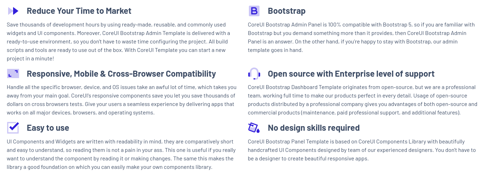

# Serverless Starter

The serverless starter template is built using AWS's cloud computing services, including API Gateway, Lambda, RDS, Cognito, VPC, ACM, Route53, S3 and Cloudfront. The infrastructure as code (IaC) approach ensures that the entire solution can be deployed and managed consistently and reliably, with changes made through version control.

Initially started the template in December 2022, and set a personal deadline to release a MVP before end of March 2023.

The idea was to learn about about the technologies and frameworks used in this template, and create a template I could open and share with the world.

Please feel free to open an issue if you would like to help extend and improve this template!

___

## Table of Contents

1. [Roadmap](#roadmap)
2. [Overview](#overview)
    1. [AWS Services](#aws-services)
    2. [Terraform](#terraform)
    3. [NestJS Framework](#nestjs-framework)
    4. [Angular Framework](#angular-framework)
    5. [CoreUI](#coreui)
    6. [PNPM](#pnpm)
    7. [Nix Package Manager](#nix-package-manager)
3. [Setup](#setup)
    1. [Requirements](#requirements)
    2. [AWS Account](#aws-account)
    3. [AWS Route 53 Root Domain](#aws-route-53-root-domain)
    4. [Nix Setup](#nix-setup)
4. [Terraform Setup and Deployments](#terraform-setup-and-deployments)
    1. [Terraform Setup](#terraform-setup)
    2. [Terraform Deployments](#terraform-deployments)
5. [Disclaimer](#disclaimer)

___

## Roadmap

- [ ] Add more notes / documentation
- [ ] Setup contributing guidelines
- [ ] Improve code quality
- [ ] Improve Dashboard with light and dark mode
- [ ] Tests in API & Web Application
- [ ] CI/CD Integration

___

## Overview

| Feature           | Description                       |
|-------------------|-----------------------------------|
| AWS               | Cloud Platform                    |
| Terraform CDK     | Infrastructure as Code            |
| Typescript        | Codebase Language                 |
| Nest.js           | API Framework                     |
| Angular 15        | Web App JS Framework              |
| Bootstrap 5       | Web App CSS Framework             |
| CoreUI            | Web App Boilerplate Framework     |
| Nix               | Package Management                |

___

### AWS Services

- AWS Route53
- AWS ACM
- AWS API Gateway
- AWS RDS PostgreSQL
- AWS Cognito
- AWS Cloudfront
- AWS Lamba
- AWS S3
- AWS VPC
- AWS IAM

___

### Terraform

[Terraform](https://www.terraform.io) is an open source Infrastructure as Code tool, created by [HashiCorp](https://en.wikipedia.org/wiki/HashiCorp).

> Terraform supports a number of cloud infrastructure providers such as Amazon Web Services, Cloudflare, Microsoft Azure, IBM Cloud, Serverspace, Google Cloud Platform, DigitalOcean, Oracle Cloud Infrastructure, Yandex.Cloud, VMware vSphere, and OpenStack.

[Cloud Development Kit for Terraform](https://developer.hashicorp.com/terraform/cdktf) **(CDKTF)** lets you use familiar programming languages to define and provision infrastructure.


___

### NestJS Framework

[NestJS Framework](https://nestjs.com) built with TypeScript. A progressive [NodeJS](http://nodejs.org) framework for building efficient and scalable server-side applications.

[Why NestJS?](https://learn.habilelabs.io/why-choose-nest-js-over-other-node-frameworks-68a13fa1e2c8)


___

### Angular Framework

[Angular](www.angular.io) is a development platform for building mobile and desktop web applications using [TypeScript](https://www.typescriptlang.org/) or [JavaScript](https://developer.mozilla.org/en-US/docs/Web/javascript) and other languages.


___

### CoreUI

[CoreUI](https://coreui.io/) is the fastest way to build a modern dashboard for any platforms, browser, or device. A complete UI Kit that allows you to quickly build eye-catching, high-quality, high-performance responsive applications.

[Angular Components Library](https://github.com/coreui/coreui-angular) built on top of [Bootstrap 5](https://getbootstrap.com/docs/5.2/getting-started/introduction/) and [TypeScript](https://www.typescriptlang.org/).

[Why CoreUI?](https://coreui.io/demos/angular/4.2/free/#/dashboard)



___

### PNPM

[PNPM](https://pnpm.io/) fast, disk space efficient package manager for [Node.js](https://nodejs.org/).

[Why PNPM?](https://youtu.be/WVnsM7Mp3JM)


___

### Nix Package Manager

[Nix](https://nixos.org/download.html) powerful package manager for Linux and other Unix systems.

[Why Nix?](https://nixos.org/#asciinema-demo-cover)


[What is NixOS & Nixpkgs?](https://nixos.org/learn.html)

> Nixpkgs is a collection of over 80,000 software packages that can be installed with the Nix package manager. It also implements NixOS, a purely-functional Linux distribution.

___

## Setup

### Requirements

- AWS Account
- Registered root domain on AWS Route53
- Nix package manager
- Visual Studio Code (optional, but recommended)

### AWS Account

An AWS account is required, sign up if you have don't have one:

<https://portal.aws.amazon.com/billing/signup>

### AWS Route 53 Root Domain

A Route 53 hosted zone / root domain (*example.com*) is needed, follow the steps below if you don't have one:

1. Go to the AWS Management Console, look for Route53 service and Click on “Get started now” under the DNS management.


2. Click on “Create Hosted Zone” and enter the domain name which you would like to use.


___

### Nix Setup

[Quick Start](https://nixos.org/manual/nix/stable/quick-start.html)

```bash
# Linux (non-NixOS)
sh <(curl -L https://nixos.org/nix/install) --daemon

# Mac
sh <(curl -L https://nixos.org/nix/install)

# Windows (run in WSL - non-NixOS Linux distributions)
sh <(curl -L https://nixos.org/nix/install) --no-daemon
```

[Highly recommended to follow the official nix package manager installation guide.](https://nixos.org/download.html#download-nix)

[Niv](https://github.com/nmattia/niv) simplifies adding and updating dependencies in Nix projects.

Execute the following in the root of the project directory to update dependencies:

```bash
niv update
```

#### Resources & Manuals

- [NixOS - Homepage](https://nixos.org/)
- [NixOS - Github](https://github.com/NixOS)
- [Nixpkgs - Manual](https://nixos.org/nixpkgs/manual)
- [Nixpkgs - Github](https://github.com/NixOS/nixpkgs)
- [Nix - Manual](https://nixos.org/nix/manual)
- [Nix - Github](https://github.com/NixOS/nix)
- [Nix - Channels & Channel Status](https://status.nixos.org/)

___

### Visual Studio Code (VS Code)

Download & install VS Code:

- [VS Code - Homepage](https://code.visualstudio.com)
- [VS Code - Direct Download](https://code.visualstudio.com/Download)

VS Code extensions:

- [EditorConfig](https://marketplace.visualstudio.com/items?itemName=EditorConfig.EditorConfig)
- [ESLint](https://marketplace.visualstudio.com/items?itemName=dbaeumer.vscode-eslint)
- [Markdown Lint](https://marketplace.visualstudio.com/items?itemName=DavidAnson.vscode-markdownlint)
- [Path Intellisense](https://marketplace.visualstudio.com/items?itemName=christian-kohler.path-intellisense)
- [Nix](https://marketplace.visualstudio.com/items?itemName=bbenoist.Nix)
- [DirEnv](https://marketplace.visualstudio.com/items?itemName=mkhl.direnv)

More extensions for Visual Studio Code can be found on the [VS Code Marketplace](https://marketplace.visualstudio.com/VSCode).

___

### Development Environment

1. Open a terminal and go to the root of the project directory, and create a copy of the **.env-sample** and rename it to **.env**, and fill in the details if needed. 

2. Execute the following step, if **direnv** is not installed:

    ```bash
    nix-shell shell.nix
    ```

3. Install NodeJS dependencies for all sub-projects by executing the following in the root project directory:

    ```bash
    npm install
    ```

4. Setup the local development environment PostgreSQL database:

    Starting the PostgreSQL database

    ```bash
    pg_ctl -o "-p 5555 -k $PWD/.pg" start
    ```

    Stopping the PostgreSQL database

    ```bash
    pg_ctl stop
    ```

5. Start the local development environment API:

    ```bash
    npm run api:start
    ```

6. Start the local development environment WEB APP:

    ```bash
    npm run web:start
    ```

___

## Terraform Setup and Deployments

### Terraform Setup

1. In the project root directory, create a copy the file `./terraform/lib/config/example.index.ts` and rename it to `./terraform/lib/config/index.ts`.

    ```bash
      cp -v ./terraform/lib/config/example.index.ts ././terraform/lib/config/index.ts
    ```

2. Replace the values within the file `./terraform/lib/config/index.ts` with your preferred configuration.

3. Execute the following in the `terraform` directory:

    ```bash
      # Terraform Synth
      npm run synth
    ```

### Terraform Deployments

1. Deploy the API stack from the project root directory, execute:

    ```bash
      # Build API
      npm run api:build
      # Builds & Deploy API Stack
      npm run api:deploy
    ```

2. Deploy the APP stack from the project root directory, execute:

    ```bash
      # Build App
      npm run app:build
      # Builds & Deploy App Stack
      npm run app:deploy
    ```

3. Backup Terraform stack state from the project root directory, execute:

    ```bash
      # Backup Terraform State to S3
      npm run tf:backup
    ```

___

## Disclaimer

Please note that all images used in the README.md are the property of the respective projects/technologies that are being referenced. I do not claim ownership of these images, and they are used solely for illustrative purposes to help describe the features and functionality of the starter template. If you believe that any image has been used inappropriately, please contact me immediately so that I can take appropriate action.

___
